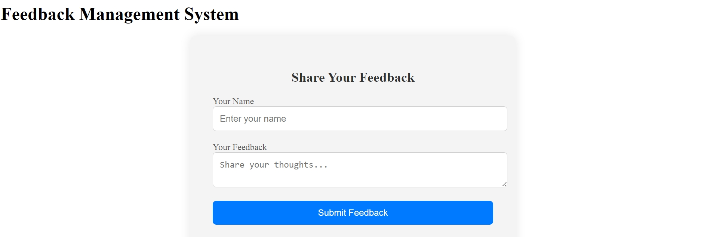
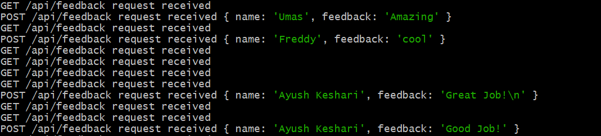

# Simple Feedback Management System

Welcome to the Simple Feedback Management System! This project allows users to submit feedback and view a list of all submitted feedbacks. It features a Node.js backend with Express, TypeScript, and a React frontend also using TypeScript.

## Features

- Submit feedback with name and message.
- Display a list of all submitted feedbacks.
- Automatically update the feedback list upon submission.
- Clean, functional, and visually appealing user interface.

## Screenshots

### Feedback Form


### Feedback List


### Backend Image


## Getting Started

### Prerequisites

- Node.js (version 14.x or later)
- npm or yarn

### Backend Setup

1. Clone the repository:
    
    ```
    git clone https://github.com/ayush2-wd/simple-feedback-management-system.git
    cd simple-feedback-management-system/backend
    ```

2. Install backend dependencies:
    
    ```
    npm install
    ```

3. Start the backend server:
    ```
    npm run dev
    ```
   The backend server will run on `http://localhost:5000`.

### Frontend Setup

1. Open a new terminal and navigate to the project directory.

2. Install frontend dependencies:
    ```
    cd ../frontend
    npm install
    ```

3. Start the frontend server:
    
    ```
    npm start
    ```
   The frontend server will run on `http://localhost:3000`.

### API Endpoints

- **GET /api/feedback**: Retrieve all feedback entries.
- **POST /api/feedback**: Submit new feedback (body: `{ name: string, feedback: string }`).


### API Communication

The frontend uses the Fetch API to communicate with the backend. The `fetchFeedbacks` function in `FeedbackForm.tsx` sends GET and POST requests to the backend API.


### Contributing

Contributions are welcome! Please fork the repository and create a pull request with your changes.

### License

This project is licensed under the MIT License.


